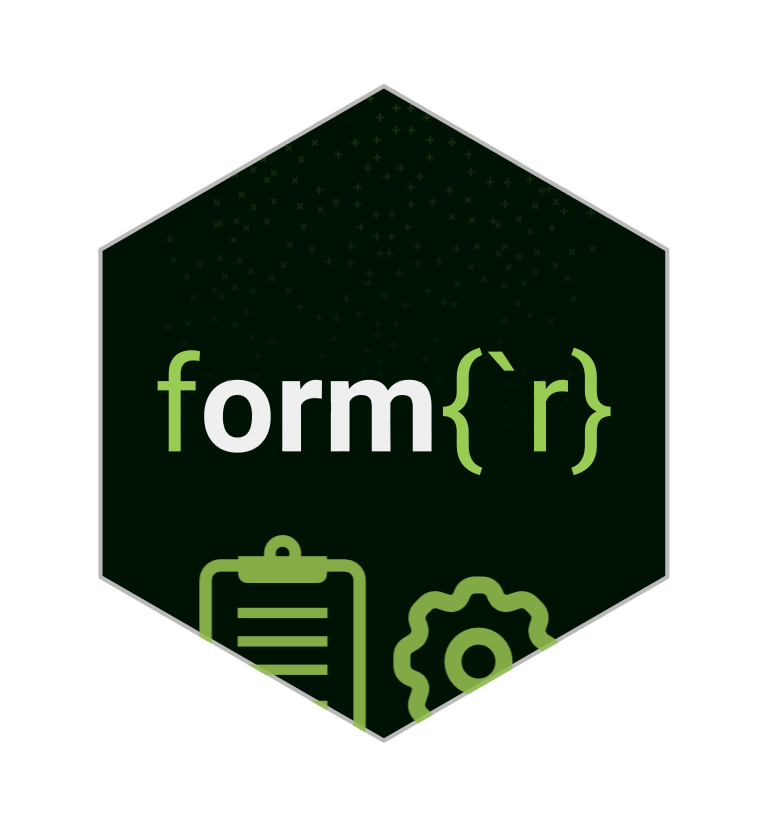

# formr 
 <!-- badges: start -->
 [](https://CRAN.R-project.org/package=formr)
  [](https://app.codecov.io/gh/rubenarslan/formr)
  <!-- badges: end -->

## The accompanying R package for the study framework [formr](https://github.com/rubenarslan/formr.org) 

The formr R package serves as a bridge between the rforms.org survey framework and your R environment. While the package is pre-loaded on the server to handle survey logic, it also provides a suite of tools for your local R workflow.

**When used locally (External Usage):** These functions streamline the administration and analysis of your study.

- Data Management: Connect to the API to fetch, type-cast, and automatically score results in a single step.
- Project Syncing: Download your study structure (surveys, CSS, assets) to your computer for local editing and version control, then push changes back to the server.

**When used within a run (Internal Usage):** These functions are designed to run inside rforms.org via OpenCPU to enhance the participant experience.

- Dynamic Feedback: Generate immediate, personalized charts and visualizations to show participants their results.
- Survey Logic: Use shorthand functions to handle complex text logic or conditional display settings within your survey units.

[You can get started right here!](vignettes/getting-started.Rmd)

## Installation

You can install the released version from CRAN:

```r
install.packages("formr")
```

Or the development version from GitHub:

```r
if (!requireNamespace("remotes")) install.packages("remotes")
remotes::install_github("rubenarslan/formr")
library(formr)
```

## Important: API V1 vs. Classic

The package currently supports two workflows.

| Feature | **API** | **Classic** |
| :--- | :--- | :--- |
| **Prefix** | `formr_api_*` | `formr_*` |
| **Auth** | OAuth (Access Tokens) | Email/Password |
| **Capabilities** | Data fetching, **Project Management (Push/Pull)**, Session manipulation. | Classic formr functions. |

## [Documentation](https://rubenarslan.github.io/formr/)

Learn how to get started and how to use the formr package to your advantage:

[https://rubenarslan.github.io/formr/](https://rubenarslan.github.io/formr/)
